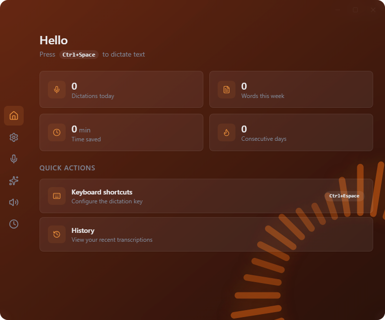
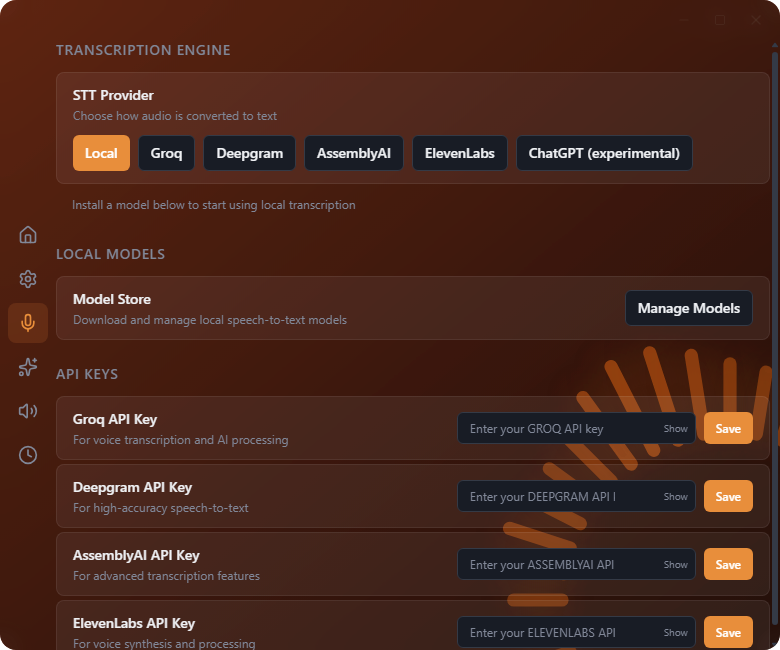
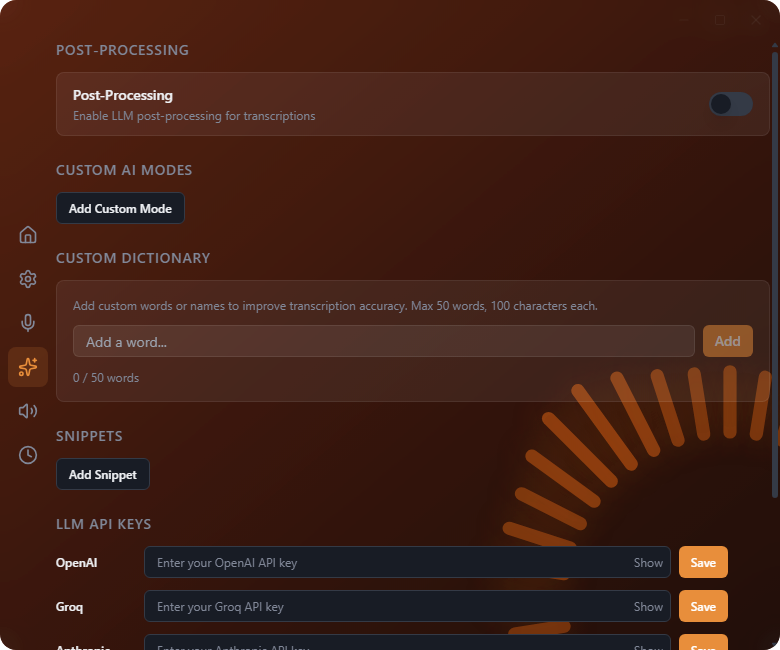

# Murmur Community

**Desktop voice dictation for Windows and macOS.** Speak, transcribe, and insert text into the app you're working in—with local speech recognition or your own cloud API keys.

[Download 0.1.1](https://github.com/airope/murmur-community/releases/tag/v0.1.1) · [Quick start](#quick-start) · [Screenshots](#screenshots) · [Contribute](#contributing)

[](https://github.com/airope/murmur-community/actions/workflows/build.yml)

No Murmur account, activation server, or subscription is required. Local recognition is the default; optional cloud services use your credentials and may charge their own fees.



## Download

**0.1.1 is an early preview.** Choose the build for your computer:

| Platform | Download |
| --- | --- |
| Windows x64 | [Windows installer (.exe)](https://github.com/airope/murmur-community/releases/download/v0.1.1/Murmur-Community-Setup-0.1.1.exe) |
| macOS · Apple Silicon | [Mac application (.zip)](https://github.com/airope/murmur-community/releases/download/v0.1.1/Murmur-Community-0.1.1-arm64.zip) |
| macOS · Intel | [Mac application (.zip)](https://github.com/airope/murmur-community/releases/download/v0.1.1/Murmur-Community-0.1.1-x64.zip) |

[Release notes](https://github.com/airope/murmur-community/releases/tag/v0.1.1) · [SHA-256 checksums](https://github.com/airope/murmur-community/releases/download/v0.1.1/SHA256SUMS)

> These binaries are **unsigned and not notarized**. Windows SmartScreen or macOS Gatekeeper may block them. Do not disable system-wide security protections. If you prefer not to approve an unsigned application, build from the reviewed source instead. Users of 0.1.0 should upgrade before using the experimental ChatGPT integration.

## Features

- **Dictate across apps.** Start and stop with a configurable global shortcut; insert recognized text through the clipboard.
- **Local speech recognition.** Download a Whisper model and its runtime, then use local recognition without cloud transcription.
- **Your choice of providers.** Optional Groq, Deepgram, AssemblyAI, and ElevenLabs speech adapters use your own API keys.
- **Optional AI rewriting.** Apply explicit AI modes to dictated text with your own provider key.
- **Local history and statistics.** Review previous dictations and usage on your computer.
- **Desktop controls.** Configure microphone, shortcuts, sounds, and interface language.

No marketing telemetry, commercial quotas, or automatic update polling. The community application has its own identity and data directory; it does not import or overwrite the previous commercial application's data.

## Screenshots

Actual application captures from the isolated Windows Electron smoke test, using a clean English-language profile. No personal transcripts or provider credentials are present. These show the interface, not a live microphone or cloud-provider demonstration. [Capture details](docs/images/README.md)

### Speech recognition

Choose local recognition or a cloud provider, and open the local model manager. Key fields are empty.



### AI processing

Optional post-processing, custom modes, dictionary, and snippets. Post-processing is off in this clean profile.



## Quick start

1. Install the Windows build, or extract the Mac ZIP and move the application to Applications.
2. Complete setup. In **Transcription → Manage Models**, install a local model and runtime. These are separate, on-demand downloads—not bundled with the app. Check the model's language support and allow sufficient disk space. [Model requirements](docs/MODELS.md)
3. Select your microphone and dictation shortcut. Grant microphone access when requested; macOS may also require Accessibility permission for text insertion.
4. Focus a text field in another app. Use your configured shortcut to start dictation, speak, then use it again to stop and insert the transcript.

For local-only use, keep **AI post-processing off** as well as selecting local speech recognition. Cloud transcription sends audio to the selected provider; cloud AI processing sends text. History is stored locally and is not an encrypted transcript vault. [Privacy and network behavior](docs/PRIVACY.md)

### Run from source

Requires Windows x64 or macOS, Node.js **22.12+ in the 22.x line** (recommended), and npm. No `.env`, backend, signing identity, or Murmur account is needed.

```sh
git clone https://github.com/airope/murmur-community.git
cd murmur-community
npm ci
npm run dev
```

The default branch may differ from the downloadable preview. To reproduce 0.1.1, check out `v0.1.1` before running `npm ci`.

## Development

Built with Electron, React, and TypeScript, with shared Windows/macOS code and separate provider adapters. [Architecture and trade-offs](docs/ARCHITECTURE.md)

```sh
npm run typecheck
npm test
npm run build
npm run test:smoke

# Package on the corresponding operating system
npm run package      # Windows
npm run package:mac  # macOS
```

CI checks Windows/macOS builds, isolated Electron startup, settings IPC, and real local recognition of a public audio fixture. The smoke test substitutes native shortcut/login-item side effects. It does **not** certify physical microphone capture, paste into every application, or authenticated cloud-provider behavior. [Verification scope](docs/VERIFICATION.md)

## Known limits

- Early preview with best-effort maintenance, not a support SLA. Linux is not a supported release target.
- Local models need disk space and CPU resources; language coverage and recognition quality vary. No speed or accuracy benchmark is claimed.
- The ChatGPT website adapter is experimental, not an official API or an OpenAI-endorsed integration. Website changes and restricted login flows can break it; prefer local recognition or supported APIs.
- Automatic active-window context detection is deliberately excluded. Explicit AI modes remain available.
- Packaging for both Mac architectures does not establish runtime testing on both. Hardware, permissions, keyboard layouts, and live provider compatibility need testing on your system.

## Contributing

Bug reports, focused fixes, documentation, and Windows/macOS compatibility reports are welcome. Include your OS, app version, steps to reproduce, and sanitized logs—never API keys or personal transcripts. Add a regression test for bug fixes and run the checks above.

Read [CONTRIBUTING.md](CONTRIBUTING.md) before opening a pull request. Report sensitive issues through [SECURITY.md](SECURITY.md), not a public issue.

## Background and license

Murmur began as a personal desktop product. This community edition separates the desktop application from the private website, billing, and account services. Development has been AI-assisted.

The current source is available under the **[MIT license](LICENSE)**. The already-published **0.1.1 release was distributed under MIT**; its [tagged license](https://github.com/airope/murmur-community/blob/v0.1.1/LICENSE) remains the reference for that release. Third-party libraries, model weights, runtimes, and APIs retain their own licenses and terms. [Third-party notices](THIRD_PARTY_NOTICES.md)
