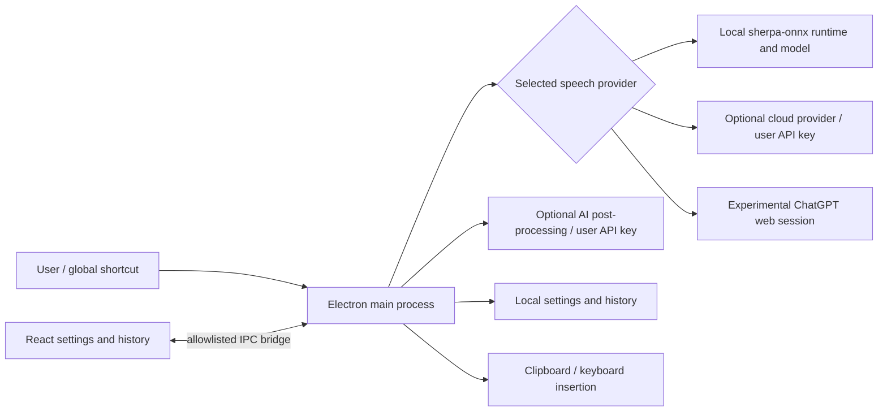

# Architecture and engineering choices

- `src/main/`: orchestration, hotkeys, recording/transcription, local models,
  provider adapters, storage and native-window lifecycle.
- `src/preload/`: explicit IPC surface between the isolated renderer and main.
- `src/renderer/`: React interface, setup, settings and local history.
- `src/shared/`: shared types, defaults and model catalog.
- `src/chatgpt/`: experimental web-integration selectors and voice controls.
- `src/overlay/`: lightweight recording indicator.

## Why one desktop repository?

Windows and macOS share the application, React UI and provider adapters.
Platform differences belong in native adapters and packaging configuration,
not in two independently maintained copies. The website and commercial backend
are deliberately outside this repository.

## Boundaries

There is no Murmur account, license server, billing, referral program, usage sync
or marketing telemetry. Community data uses a separate application identity;
existing commercial settings and history are not imported automatically.

## Trade-offs

Electron offers one UI and cross-platform desktop APIs at the cost of memory and
installer size. Local recognition avoids uploading audio but requires a separate
model/runtime download and depends on CPU, language and model quality. Cloud
providers can improve convenience or accuracy but incur network disclosure and
provider fees. No accuracy or speed benchmark is claimed here.

ChatGPT browser automation is experimental and fragile: selectors, login and
service behavior can change independently. It is not an official API or an
OpenAI-endorsed integration. Local recognition and BYOK APIs are the preferred
paths. The implementation does not bypass provider authentication.

Automatic active-window context detection is excluded from the initial community
edition to reduce permissions, metadata exposure and native dependency risk.
Explicit AI modes remain available.
